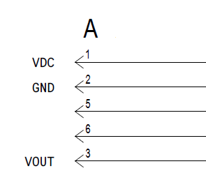
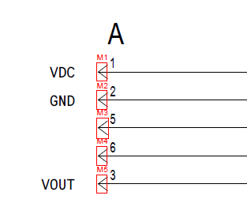
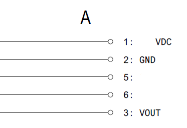
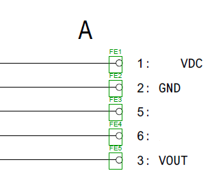
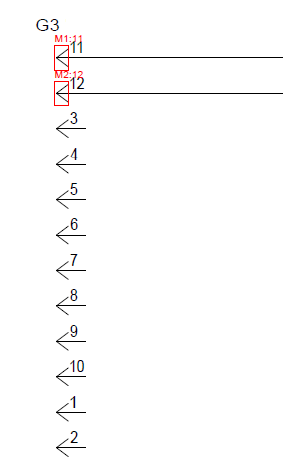
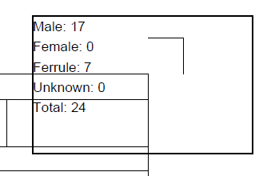

# Software Pipeline

This folder contains the CPU-side visual detection pipeline used by the FPGA
project. The software reads engineering drawing PDFs, detects cable-terminal
features, classifies each detected endpoint, and writes an annotated PDF plus
debug images.

The FPGA work in `../hls/` is intended to accelerate the most regular image
processing stages. This software remains the reference implementation and the
PS-side integration target.

## Example Results

The examples below show small, non-confidential snippets of the input drawing
style and the annotated detector output.

| Input snippet | Annotated output |
|---|---|
|  |  |
|  |  |

Additional output examples:

| Male detections | Ferrule detections | Page count summary | Dense connector area |
|---|---|---|---|
|  |  |  |  |

*In the male-terminal detection results, pins 3, 4, 5, 6, 7, 8, 9, 10, 1, and 2 are identified as dummy pins since they have no wire connections. These pins are not included in the final terminal count

Annotation legend:

- `M#`: male terminal, drawn in red.
- `F#`: female terminal, drawn in blue.
- `FE#`: ferrule terminal, drawn in green.
- `U#`: unknown candidate, drawn in orange.
- Labels such as `M1:11` include the detector ID and the nearby pin/wire label.

## Main Entry Point

`terminal_counter_endpoint_first.py` is the main detector.

It accepts one input PDF and six template inputs:

- male-left/right template or template directory
- female-left/right template or template directory
- ferrule-left/right template or template directory

Template inputs may be a single image or a directory. When a base image is
provided, the loader also picks up sibling variants with the same stem, such as
`male_left_02.png`.

## How Detection Works

The pipeline is endpoint-first. It does not scan the entire page blindly with
every template. Instead, it finds likely wire endpoints first, then performs
local template matching around those candidates.

1. `render_page`
   - Uses PyMuPDF to rasterize the PDF page at the selected zoom level.
   - Produces both BGR and grayscale page images.

2. `to_binary_inv`
   - Applies a 3x3 Gaussian blur.
   - Uses Otsu thresholding to create a binary image where drawing ink is white
     and background is black.

3. `extract_words` and `build_text_suppressed_binary`
   - Extracts text boxes from the PDF.
   - Removes text from the binary image so pin labels do not look like wire or
     terminal geometry.

4. `extract_horizontal_segments_vector`
   - Reads vector line geometry directly from the PDF when possible.
   - Falls back to `extract_horizontal_segments_raster` if the vector path does
     not find enough horizontal wire segments.

5. `collect_endpoint_candidates`
   - Converts segment ends into left-side and right-side endpoint candidates.
   - Uses local density checks, nearby text checks, and duplicate filtering to
     keep the candidate list small.

6. `classify_endpoint`
   - Builds a local patch around each endpoint.
   - Runs OpenCV template matching against male, female, and ferrule templates.
   - Uses score thresholds and score margins to choose the tentative class.

7. Ferrule and label heuristics
   - Runs shape checks for ferrule candidates.
   - Looks for nearby pin or wire labels.
   - Promotes or rejects ambiguous detections based on class score, label
     support, and local geometry.

8. `dedupe_detections`
   - Removes duplicate boxes using endpoint distance and IoU checks.
   - Sorts detections and assigns stable IDs: `M#`, `F#`, `FE#`, or `U#`.

9. `annotate_page` and `draw_debug_image`
   - Draws final boxes and labels into the output PDF.
   - Writes debug PNGs with candidates and detections overlaid.
   - Adds the summary count box in the top-right corner of each page.

## Supporting Scripts

| Script | Purpose |
|---|---|
| `terminal_counter_endpoint_first.py` | Main single-PDF detector and annotation flow. |
| `batch_run_terminal_counter.py` | Runs the detector over one PDF or a directory of PDFs and writes a summary CSV. |
| `evaluate_expected_results.py` | Compares detector counts against an expected-results workbook and can export review crops. |
| `generate_terminal_templates.py` | Helps create template PNGs from selected PDF crop regions. |
| `threshold_sweep_terminal_counter.py` | Sweeps score thresholds to tune detector behavior. |
| `binarize_dma_checks.py` | Checks software/PL binarization behavior during FPGA bring-up. |
| `tme_driver.py` | PYNQ-side driver scaffold for the hardware template-matching pipeline. |

## Batch Processing

Use `batch_run_terminal_counter.py` when running many drawings:

The batch runner creates annotated PDFs, debug images, logs, and a summary CSV.
Generated batch outputs are ignored by Git.

## FPGA Integration Point

The HLS/FPGA path keeps the same high-level software flow. The planned hardware
handoff points are:

- Replace `to_binary_inv` with PL-assisted binarization.
- Replace local `cv2.matchTemplate` calls inside `classify_endpoint` with the
  template matching accelerator.
- Keep PDF rendering, text extraction, candidate generation, post-processing,
  and annotation in Python.

This split keeps PDF-specific and control-heavy logic in software while moving
streaming pixel operations to the FPGA fabric.
